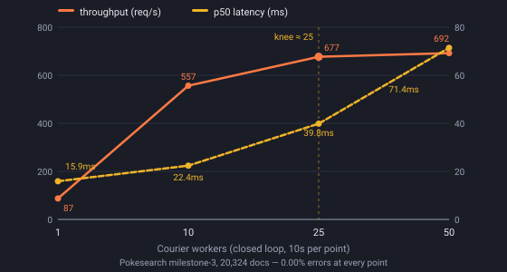
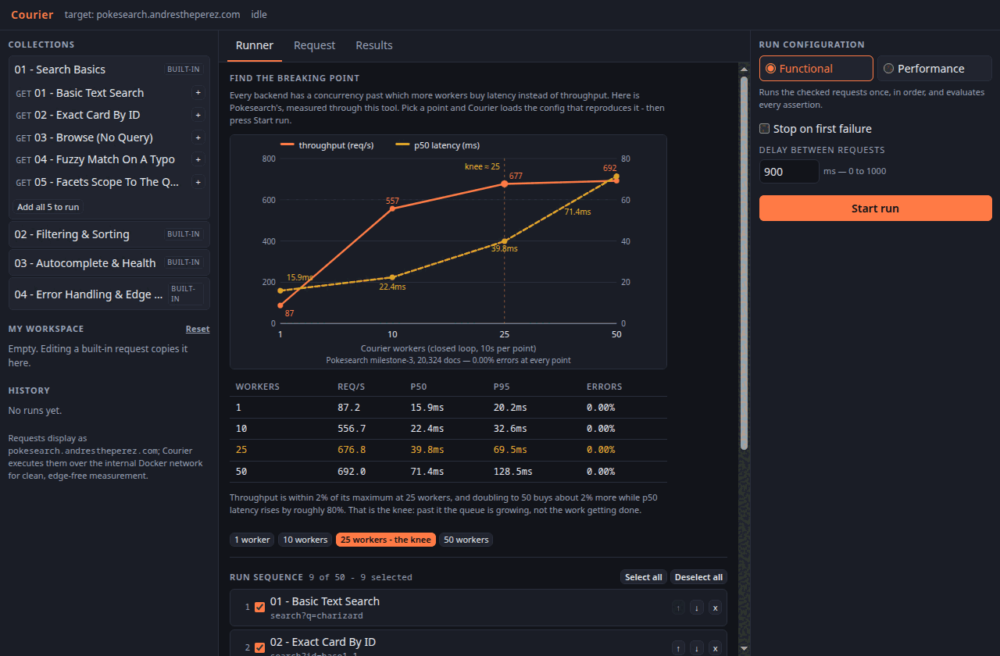

# Courier

[](https://github.com/AndresThePerez/courier/actions/workflows/ci.yml)
[](https://go.dev/)
[](go.mod)

> Badges resolve once the repository is pushed to GitHub. `.github/workflows/ci.yml`
> runs `go vet ./...`, `go test -race ./...`, `go build ./...`, and the Docker image
> build on every push and pull request to `main`.

A public, Postman-style API test runner and load tester: **one Go binary** that serves
an embedded three-pane UI, runs curated request collections against a sandboxed target
in two modes — **Functional** (sequential, declarative assertions, results streaming in
row-by-row) and **Performance** (a worker-pool load engine with fan-in aggregation) —
streams live results over **SSE with reconnect replay and a polling fallback**, prices
aggregate load with a **token-bucket admission budget**, and exports any report as a
single-page PDF rendered in pure Go. Stdlib everywhere, one direct dependency (the PDF
writer), no frontend build step.

## The numbers

Measured against the pinned 20,324-document Pokesearch index (Milestone 3 build), on
the dev workstation:

| workers | req/s | p50 | p95 | error rate | verdict (p95 ≤ 50ms) |
|---:|---:|---:|---:|---:|---|
| 1 | 87.2 | 15.89 ms | 20.19 ms | 0.00% | PASS |
| 10 | 556.7 | 22.38 ms | 32.63 ms | 0.00% | PASS |
| **25** | **676.8** | **39.84 ms** | **69.45 ms** | **0.00%** | FAIL |
| 50 | 692.0 | 71.40 ms | 128.49 ms | 0.00% | FAIL |



**The knee is at ~25 workers.** Doubling the load to 50 buys +2.2% throughput and costs
+79% median latency — past the knee the extra concurrency is queueing, not working.
Error rate stays 0.00% at every point (the target degrades gracefully rather than
falling over), and the SLO verdict flips *before* the knee, which is the point of
having one. Two independent series agree within 1.5%; raw data, run ids, and the
methodology are in [docs/knee.md](docs/knee.md). Reproduce any point in one click from
the UI's **Find the breaking point** panel.

Courier's own cost stays out of the measurement: **engine overhead is ~1.8 µs per
dispatch** (measured: perf-mode dispatch vs a bare `http.Client` baseline), the fan-in
aggregator records a result in **115 ns with zero allocations**, and the sustained-load
ceiling is **provably 10% duty cycle at maximum concurrency** — an executable proof, not
a promise (see below).

## Try it in 60 seconds

1. Open the demo. Expand **01 — Search Basics** in the sidebar and click **Add all to
   run**, then **Start Run** — watch functional results stream in live, row by row,
   each with its assertion outcomes.
2. Switch the mode to **Performance**, set 50 workers × 10s (or click a point in the
   **Find the breaking point** panel), start it, and watch the live counters — then the
   verdict, SLA ladder, Apdex, and histogram render from the finished report.
3. Open any request in the editor, change a parameter, and **Send** it. Try an illegal
   value (`page_size=abc`) — the field-naming `400` that comes back is the target's
   strict contract, surfaced verbatim. Courier's own sandbox sits in front of it:
   param *keys* are chosen from each endpoint's server-provided allowlist, and anything
   outside it is refused before a byte reaches the target. Editing a built-in request
   forks a private copy into **My Workspace** (fork-on-write; the curated tree never
   mutates).



## Architecture

```
Browser (vanilla ES modules, embedded in the binary — no build step)
  └─▶ Cloudflare edge → cloudflared tunnel
        Courier container (Go, net/http, stdlib-first)
          /                         → embedded static UI (embed.FS)
          /api/collections          → curated collections + endpoint catalog
          /api/runs                 → POST start · GET history (in-memory ring)
          /api/runs/{id}            → GET report (partial while running — the
                                      polling fallback) · DELETE cancel
          /api/runs/{id}/stream     → SSE live results (replay log on subscribe)
          /api/runs/{id}/report.pdf → single-page PDF export (pure Go)
          /api/send                 → the editor's single-request Send
          /api/status               → {running, run_id?, cooldown_until?, ...}
          /metrics · /healthz       → self-telemetry (expvar) · liveness
              ── internal Docker network ──▶ Pokesearch (never via the public edge)
```

Requests display as `pokesearch.andrestheperez.com`; Courier executes them over the
internal container network, so the numbers measure the target — not Cloudflare's edge,
not the tunnel.

## Design decisions

The full stories — including the two admission-control designs that failed simulation
before the budget — are in [docs/design.md](docs/design.md). The short list:

- **The server never accepts a URL from the client.** A run payload is
  `{endpoint_id, params, assertions}`; the target is fixed at startup and paths come
  from a closed server-side catalog with per-endpoint parameter allowlists. Curated and
  visitor-edited requests pass identical validation. A load tester that takes a target
  URL from the browser is a DDoS cannon with a nice UI — this one physically cannot be.
- **The cooldown is a load budget** — a token bucket in worker-seconds (refill 5/s,
  burst 1500, 5s floor). Sustained load provably converges to `R / max_workers` = a
  **10.0% duty cycle** under every adversarial shape; the in-repo simulator
  (`go test ./internal/budget/ -run Sim`) measures 10.03% for max-runs, cancel-spam,
  and interleaved traffic, and **0.75%** for the curated happy path. Cancels cost
  exactly what they consumed; honest visitors never leave the 5s floor.
- **Walk me through the concurrency:** two contexts per run (the dispatch deadline
  never cancels an in-flight request — that would turn honest tail latency into fake
  transport errors); N workers fan results into one channel; **a single aggregator
  goroutine owns all run state** — no atomics, no mutexes, no torn snapshots. Share
  memory by communicating, one owner per piece of state.
- **Aborted is a category, not an error.** Requests killed by Courier's own
  cancel/deadline/shutdown are attributed to Courier, never to the target — so a
  visitor pressing Cancel cannot manufacture a failing verdict. Cancelled and expired
  runs render **"N/A — partial data"** instead of a verdict computed from a truncated
  sample. The invariant `requests == ok + errors + aborted` is tested.
- **Live updates degrade, never lie.** SSE first (2s heartbeat, bounded replay log on
  subscribe — a reconnect or mid-run spectator repaints complete state); a slow
  subscriber is disconnected and self-heals via replay rather than silently losing
  rows; past the subscriber cap the server answers `503 {"poll":true}` and the client
  falls back to 500ms polling of the same report shape. Both transports feed one
  reducer — no render code knows which is active. SSE meets the Cloudflare tunnel at
  deploy; the fallback exists because buffering there would otherwise kill live
  results outright.
- **The transport is tuned for measurement:** `MaxIdleConnsPerHost` ≥ worker count
  (Go's default of 2 would thrash connections and distort latency), every body drained
  to `io.Discard` so connections are reused, latency measured to end-of-body in both
  modes so the numbers are comparable with `hey`.
- **One direct dependency** (`go-pdf/fpdf`), stdlib for everything else — including
  the SSE broadcaster, the token bucket, the histogram, and the frontend (vanilla ES
  modules served from `embed.FS`).
- **Self-telemetry with a sandbox posture:** `/metrics` is a curated expvar map (no
  `cmdline`, no `memstats` — a public demo should not hand out its own command line);
  pprof binds loopback-only and **refuses** any other address rather than quietly
  publishing process memory.

## Sandbox model

**The server never accepts a URL from the client. Ever.**

A run payload is `{endpoint_id, params, assertions}` — never a host, never a path. The
target base URL comes from the `TARGET_URL` environment variable and is fixed at startup;
paths come from a server-side endpoint catalog that is a closed set. Each endpoint carries
its own ordered parameter allowlist, and that allowlist is the single source of truth:
unknown keys are rejected, values are truncated to the length bound, and curated and
visitor-edited requests go through identical validation. Any code path that would let a
run payload influence the host is a design violation, not a bug.

## Caps

Server-enforced regardless of client input. Structural violations are **rejected**;
numeric knobs are **clamped**.

| Cap | Value |
|---|---|
| Max concurrency (performance) | 50 workers (clamped) |
| Max duration (performance) | 30s (clamped) |
| Max wall-clock (functional) | 120s hard deadline; remaining entries marked skipped |
| Concurrent runs | 1 globally — `409 Conflict` |
| Cooldown between runs | A global load budget: token bucket in worker-seconds (refill 5/s, burst 1500), floored at 5s; `409` with `cooldown_until` |
| Per-request timeout | ~10s hard `http.Client.Timeout` |
| Max requests per sequence | 50 |
| Max assertions per request | 20 |
| Functional `delay_ms` | ≤ 1000 |
| Param value length | ≤ 500 chars (truncated, not rejected) |
| Concurrent single-request sends | 1 globally — `429` |

## Engine overhead

Courier measures a target, so its own cost has to be small enough not to be part of
the measurement. `go test -bench` numbers on a Ryzen 5800X:

| Operation | Cost | Allocations |
|---|---|---|
| Per-dispatch engine overhead, performance mode (`DispatchDrain` − bare-client baseline) | **~1.8 µs** | +11 |
| Fan-in aggregator, record one result | 115 ns | 0 |
| JSON path lookup, shallow (`$.total`) | 132 ns | 1 |
| JSON path lookup, deep (`$.results[23].attacks[0].cost[3]`) | 661 ns | 3 |
| Assertion evaluation, `status` / `latency` | 131 / 143 ns | 2 / 4 |
| Assertion evaluation, `json` ops | 245–511 ns | 4–7 |
| Assertion evaluation, `body_contains` (body folded once at decode) | 284 ns | 4 |
| Decode + fold one 36KB search response (`NewTarget`) | 438 µs | 5,998 |
| **Full functional request: decode + 20 assertions at the cap** | **452 µs** | 6,141 |
| Percentile over 1k / 18k / 100k samples | 1.7 ns (O(1)) | 0 |
| `ComputeStats` over 18k samples (sort + percentiles + ladder + Apdex + histogram) | 1.06 ms | 6 |
| Record one response into a `Tally` | 31 ns | 0 |

Reading them: a functional request costs ~452 µs of Courier against 1–30 ms of network
and target time. **Performance mode does none of that work** — no assertion evaluation,
bodies straight to `io.Discard` — which is what the 1.8 µs figure measures, about
0.007% of a real 25ms request at 50 workers.

**Whole-process footprint during a maximum run** (50 workers × 30s, 20,624 requests
against the live target, measured from `/proc`): **3.3 CPU-seconds — about 10% of one
core** (~160 µs of total process CPU per request, kernel networking and SSE included)
and a **peak RSS of 20 MB**. That is the co-hosting cost the Host decision discloses:
running the tester next to the target spends a tenth of a core and twenty megabytes.

## What happens when the target dies

Evidence, not claims: during a 10-worker 15-second run the target process was SIGKILLed
at the 5-second mark, on purpose. The run **completed cleanly at its full duration** —
974,606 dispatches accounted as 5,910 ok + 968,696 errors + 0 aborted (the invariant
holds), every failure attributed as a `connection` error with status `0 (transport
error)`, Apdex 0.006, verdict FAIL at a 99.39% error rate. No phantom aborts, no wedged
lock (`/api/status` returned `running:false` immediately after), history intact, and the
next run — target restored — passed at 100% 2xx without restarting Courier. The saved
report, the rendered dashboard screenshot, and the drill notes are in
[docs/failure-story/](docs/failure-story/).

## Closed-loop honesty note

Courier is a **closed-loop** tester: workers wait for each response before issuing the
next, like `hey`, not open-loop fixed-rate like `vegeta`. Under saturation this
understates tail latency (coordinated omission). That is a fine trade for this
demonstration, and it is stated plainly here and in the report footer rather than
quietly assumed. Tester and target also share one host over the internal network —
Courier's per-request work is measured above precisely so that contention stays
disclosed rather than hidden in the target's numbers.

## Running locally

```bash
# Target: the shared dev Pokesearch on 8081 (8080 is taken on the dev workstation).
PORT=8084 TARGET_URL=http://127.0.0.1:8081 go run ./cmd/server

curl -s localhost:8084/healthz    # -> {"status":"ok"}
open http://localhost:8084/
```

Environment: `PORT` (default `8080`), `TARGET_URL` (default `http://127.0.0.1:8081`),
`TARGET_DISPLAY` (the friendly target name shown in the UI and the PDF),
`PPROF_ADDR` (loopback-only pprof listener, default `127.0.0.1:6060`, `off` to disable).

Container: `docker compose -f docker-compose.yml -f docker-compose.dev.yml up --build`
(see `NOTE.md` N31 for the compose-merge and firewalld caveats).

Acceptance matrix (needs a running Courier and the pinned target):
`go test -tags acceptance ./internal/acceptance/ -v`
