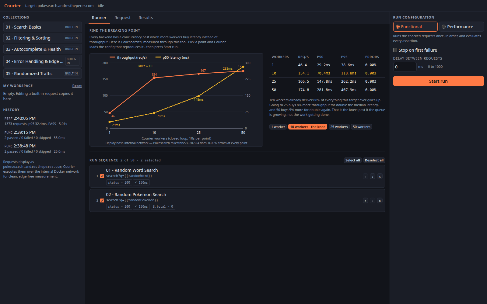

# Courier

[](https://github.com/AndresThePerez/Courier/actions/workflows/ci.yml)
[](go.mod)
[](go.mod)
[](LICENSE)

### **[Live demo → courier.andrestheperez.com](https://courier.andrestheperez.com)**

Courier is a Postman-style API test runner and load tester that ships as **one Go binary**: an embedded three-pane UI, curated request collections, a sequential **Functional** runner with declarative assertions, and a worker-pool **Performance** engine with fan-in aggregation. Results stream live over **SSE with reconnect replay and a polling fallback**, aggregate load is priced against a **token-bucket admission budget**, and any report exports as a single-page PDF rendered in pure Go. Stdlib everywhere, one direct dependency (the PDF writer), no frontend build step.

The interesting constraint is that it is *public*. A load tester exposed to the internet is a DDoS cannon with a nice UI unless the design forbids it, so the server never accepts a URL from the client — a run payload is `{endpoint_id, params, assertions}` against a target fixed at startup and a closed server-side endpoint catalog. Sustained load is bounded in worker-seconds by a token-bucket budget whose 10% duty cycle is proven by an in-repo simulator rather than asserted; request volume is bounded only in proportion to target latency, because a dead target and a healthy one are charged the same worker-seconds and the dead one dispatches far more requests for them. Run state is owned by exactly one goroutine (no atomics, no mutexes, no torn snapshots), and Courier publishes its own per-dispatch overhead so you can see it is not part of the measurement.



## The numbers

Measured against the pinned 20,324-document PokéSearch index (Milestone 3 build) on
the deploy host, over the internal container network — the numbers the live demo's
panel shows and its SLOs are calibrated to:

| workers | req/s | p50 | p95 | error rate | verdict (p95 ≤ 150ms) |
|---:|---:|---:|---:|---:|---|
| 1 | 46.4 | 29.24 ms | 38.64 ms | 0.00% | PASS |
| **10** | **154.1** | **70.36 ms** | **118.80 ms** | **0.00%** | PASS |
| 25 | 166.5 | 147.85 ms | 262.24 ms | 0.00% | FAIL |
| 50 | 174.8 | 281.83 ms | 407.93 ms | 0.00% | FAIL |


**The knee is at ~10 workers on this hardware.** Ten workers already deliver 88% of
everything the target ever gives up; 25 buys +8% throughput for double the median
latency, and 50 buys +5% for double again — past the knee the extra concurrency is
queueing, not working. Error rate stays 0.00% at every point (the target degrades
gracefully rather than falling over), and the SLO verdict flips *between* 10 and 25
workers, which is the point of having one. The same series on the dev workstation (a
5800X: knee ~25, peak 692 req/s), the raw data, run ids, and methodology are in
[docs/knee.md](docs/knee.md). Reproduce any point in one click from the UI's
**Find the breaking point** panel. The table prints p50 and p95; every run's report
carries the whole ladder, min, avg, p50, p90, p95, p99 and max, taken nearest-rank so a
published p99 is a latency some request actually experienced rather than an
interpolation between two that did not.
The target is [PokéSearch](https://github.com/AndresThePerez/PokeSearch), an
Elasticsearch search engine for a 20,324-card Pokemon TCG corpus, also built
here: Courier load-tested it and found its knee at ten workers, which is the
number above.

Courier's own cost stays out of the measurement: **engine overhead is ~1.8 µs per
dispatch** (measured: perf-mode dispatch vs a bare `http.Client` baseline), the fan-in
aggregator records a result in **115 ns with zero allocations**, and the sustained-load
ceiling is **provably 10% duty cycle at maximum concurrency** — an executable proof, not
a promise. The full benchmark table is in [docs/design.md#engine-overhead](docs/design.md#engine-overhead).

**And when the target died mid-run, the run finished cleanly and the accounting
held to the dispatch:** 974,606 dispatches as 5,910 ok plus 968,696 errors plus 0
aborted, every failure attributed to the transport rather than to the target, no
phantom aborts and no wedged lock. The drill, the stored report and the rendered
dashboard are in [what happens when the target dies](docs/design.md#what-happens-when-the-target-dies).

## Tests

```bash
go vet ./...
go test -race ./...
go build ./...
```

214 test functions and 16 benchmarks, per-package coverage of **87.0% to 100% on every
package that carries logic**, and the **race detector** on every push. The two packages
where a defect would cost the most are the two highest: `internal/report`, the accounting
maths, at 96.4%, and `internal/sandbox`, the security boundary, at 96.8%. The range is
stated rather than badged on purpose: `cmd/server` carries no test file of its own and the
end-to-end acceptance matrix is build-tagged, so one repository-wide number would read
lower than the floor every package that carries logic actually clears.

CI runs those three commands on every push to every branch and on every pull request,
alongside a `go mod tidy` cleanliness gate, `gofmt`, `staticcheck`, `govulncheck`, a
coverage floor, and a separate job that builds the Docker image. The load-budget proof and
the PDF's byte-determinism are tests, so both re-run on every push; the chaos drill that
SIGKILLs the target mid-run is a recorded exercise rather than a test
([what it held to](docs/design.md#what-happens-when-the-target-dies)).

The admission-budget simulator drives the 10% duty-cycle proof; the acceptance matrix is
build-tagged and needs a running Courier and target, reading `COURIER_URL` (default
`http://127.0.0.1:8084`) plus `STUB_URL` and `STUB_TARGET_URL` for the stub-target cases:

```bash
go test ./internal/budget/ -run Sim
go test -tags acceptance ./internal/acceptance/ -v -timeout 20m
```

## Try it in 60 seconds

Open the [live demo](https://courier.andrestheperez.com) — the unabridged walkthrough is in [docs/design.md#try-it-in-60-seconds](docs/design.md#try-it-in-60-seconds):

1. Expand **01 — Search Basics**, **Add all to run**, then **Start Run**: functional results
   stream in live over SSE, row by row, each row carrying its own assertion outcomes.
2. Switch the mode to **Performance** and press **10 workers - the knee**, the five-request
   sequence the table above was measured with; the finished report renders a verdict, SLA ladder, Apdex and histogram, and at 25 or 50 workers the verdict flips.
3. Open any request in the editor, change a parameter, and **Send** it. `page_size=abc` returns
   the target's field-naming `400` verbatim; keys outside the endpoint's allowlist never reach it.
4. Expand **05 — Randomized Traffic**: `{{randomWord}}` and `{{randomPokemon}}` resolve to a fresh
   random value for every dispatched request, so a performance run queries something new each time.


## Architecture

```
Browser (vanilla ES modules, embedded in the binary — no build step)
  └─▶ Cloudflare edge → cloudflared tunnel
        Courier container (Go, net/http, stdlib-first)
          /                         → embedded static UI (embed.FS)
          /api/collections          → curated collections + endpoint catalog
          /api/runs                 → POST start · GET history (in-memory ring)
          /api/runs/{id}            → GET report (partial while running — the
                                      polling fallback) · DELETE cancel
          /api/runs/{id}/stream     → SSE live results (replay log on subscribe)
          /api/runs/{id}/report.pdf → single-page PDF export (pure Go)
          /api/send                 → the editor's single-request Send
          /api/status               → {running, run_id?, cooldown_until?, ...}
          /metrics · /healthz       → self-telemetry (expvar) · liveness
              ── internal Docker network ──▶ target service (never via the public edge)
```

Routes are registered with method-scoped patterns, `pprof` gets its own loopback-only listener
instead of a place on this mux, and shutdown cancels the in-flight run before it stops the HTTP server — [why that order is the whole trick](docs/design.md#architecture).

On the live deployment the target is PokéSearch. Requests display as
`pokesearch.andrestheperez.com`; Courier executes them over the internal container
network, so the numbers measure the target — not Cloudflare's edge, not the tunnel.

## Design decisions

One line each; the full stories — including the two admission-control designs that failed simulation before the budget — are in [docs/design.md#design-decisions](docs/design.md#design-decisions).

- **The server never accepts a URL from the client.** A run payload is `{endpoint_id, params, assertions}`; the target is fixed at startup and paths come from a closed server-side catalog with per-endpoint parameter allowlists.
- **The cooldown is a load budget** — a token bucket in worker-seconds (refill 5/s, burst 1500, 5s floor) whose sustained load provably converges to a **10.0% duty cycle**, measured by an in-repo simulator (`go test ./internal/budget/ -run Sim`) rather than asserted.
- **Two contexts per run, one owner for run state.** The dispatch deadline never cancels an in-flight request; the worker pool fans results into one channel and a single aggregator goroutine owns every counter — no atomics, no mutexes, no torn snapshots.
- **Aborted is a category, not an error.** Requests killed by Courier's own cancel, deadline or shutdown are attributed to Courier, never to the target, so a visitor pressing Cancel cannot manufacture a failing verdict; `requests == ok + errors + aborted` is tested.
- **Live updates degrade, never lie.** SSE with a 2s heartbeat and a 512-entry replay log, a slow subscriber disconnected rather than silently starved, `503 {"poll":true}` past 100 subscribers, and 500ms polling of the same report shape as the fallback — both transports feed one reducer.
- **The transport is tuned for measurement.** `MaxIdleConnsPerHost` ≥ worker count, every body drained to `io.Discard`, latency measured to end-of-body in both modes so the numbers are comparable with `hey`.
- **One direct dependency** (`go-pdf/fpdf`), stdlib for everything else — including the SSE broadcaster, the token bucket, the histogram, and the vanilla ES-module frontend served from `embed.FS`.

## Sandbox model

**The server never accepts a URL from the client. Ever.**

A run payload is `{endpoint_id, params, assertions}` — never a host, never a path. The
target base URL comes from the `TARGET_URL` environment variable and is fixed at startup;
paths come from a server-side endpoint catalog that is a closed set. Each endpoint carries
its own ordered parameter allowlist, and that allowlist is the single source of truth:
unknown keys are rejected, values are truncated to the length bound, and curated and
visitor-edited requests go through identical validation. Any code path that would let a
run payload influence the host is a design violation, not a bug.

## Observability

Courier instruments itself, not only its target: `/metrics` is a curated expvar map (no `cmdline`,
no `memstats` — a public demo should not hand out its own command line), pprof binds loopback-only
and **refuses** any other address, and every engine log line for a run that started is structured
JSON carrying an `event` and a `run_id`, so one `jq` filter returns a single run's complete story,
admission decision and budget arithmetic included. Requests that arrive through the edge log its
request id, so a visitor's report joins to a server log line.

What is deliberately absent is named rather than left for a reader to notice — no metrics
history, no Prometheus exposition format, no scrape target, no tracing, no alerting — and so
is the closed-loop tester's blind spot: [the limits](docs/design.md#observability), [coordinated omission](docs/design.md#closed-loop-honesty-note).

## Caps

Server-enforced regardless of client input; structural violations are **rejected**, numeric knobs **clamped** ([the reasoning](docs/design.md#caps)).

| Cap | Value |
|---|---|
| Max concurrency (performance) | 50 workers (clamped; default 10) |
| Max duration (performance) | 30s (clamped; default 10s) |
| Max wall-clock (functional) | 120s hard deadline; remaining entries marked skipped |
| Concurrent runs | 1 globally — `409 Conflict` |
| Cooldown between runs | A global load budget: token bucket in worker-seconds (refill 5/s, burst 1500), floored at 5s; `409` with `cooldown_until` |
| Per-request timeout | 10s hard `http.Client.Timeout` |
| Max requests per sequence | 50 (rejected) |
| Max assertions per request | 20 (rejected) |
| Functional `delay_ms` | ≤ 1000 (clamped) |
| Param value length | ≤ 500 chars (truncated, not rejected) |
| Param/request name length | ≤ 120 chars (truncated) |
| API request payload | ≤ 256 KiB (rejected) |
| Response body read for assertions | ≤ 1 MiB (truncated) |
| Response body stored on a run result | ≤ 16 KiB preview |
| Response body kept by the editor's **Send** | ≤ 256 KiB — the one response a visitor is actively reading is not cut to the preview size |
| Run history | last 20 runs (in-memory ring) |
| SSE subscribers per run | 100, then `503 {"poll":true}` |
| Concurrent single-request sends | 1 globally — `429` |

## Running locally

Courier needs a target to point at; the live demo uses PokéSearch, whose 20,324-card index the
curated assertions are pinned to. That caveat, the port note, the Compose deep-merge and the container stage: [docs/design.md#running-locally](docs/design.md#running-locally).

```bash
# Serve Courier on 8084, pointed at a target listening on 8081.
PORT=8084 TARGET_URL=http://127.0.0.1:8081 go run ./cmd/server

curl -s localhost:8084/healthz    # -> {"status":"ok"}
# then open http://localhost:8084/
```

| Variable | Default | Meaning |
|---|---|---|
| `PORT` | `8080` | Port the embedded UI and API listen on |
| `TARGET_URL` | `http://127.0.0.1:8081` | Base URL of the target under test. Fixed at startup — never client-supplied |
| `TARGET_DISPLAY` | `pokesearch.andrestheperez.com` | Friendly target name shown in the UI and the PDF |
| `PPROF_ADDR` | `127.0.0.1:6060` | Loopback-only pprof listener. Set `off` to disable; a non-loopback address is refused, not bound |

Container:

```bash
docker compose -f docker-compose.yml -f docker-compose.dev.yml up --build
```

## License

[MIT](LICENSE) © 2026 Andres Perez.

Postman is a trademark of Postman, Inc.; Courier is an independent project, not
affiliated with or endorsed by Postman, Inc.

The live demo exercises a Pokémon TCG search target and therefore displays Pokémon card
data. Pokémon and Pokémon character names are trademarks of Nintendo, Creatures Inc.,
and GAME FREAK inc.; card data comes from the `pokemon-tcg-data` dataset. This project
is unaffiliated with those companies and is non-commercial.
